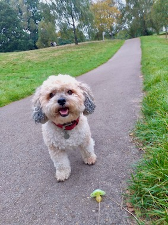

# PS52007D Research Methods in Psychology - Slides 

## Academic Year 2022-23

This is the first year I am trying to deliver Open First teaching materials. "If a job's worth doing, it's worth over-doing!" as they say. 
I welcome feedback and tips/suggestions on how to improve.
Key priorities: 
- Accessibility
- Engagement via content and by use of technology
- Inclusivity
- Playfulness

---

### Workshop 1: Teaching R online with RStudio Cloud
#### Friday July 3rd, 2 - 3:30pm BST

### Slides for Lecture 01
- [html](https://ps52007dslides.littlemonkeylab.com/Lecture01/Lecture1-RJS.html#/title-slide)  
- [pdf](https://ps52007dslides.littlemonkeylab.com/Lecture01/Lecture1.pdf) 
- [Powerpoint](https://ps52007dslides.littlemonkeylab.com/Lecture01/Lecture1.pptx) 

### [Video](https://media.ed.ac.uk/playlist/dedicated/169801461/1_gjzcgkec/1_bz9yza6s)

### [Activity](https://mine-cetinkaya-rundel.github.io/teach-r-online/01-cloud/01-cloud.html#2) while we wait to get started...
---

