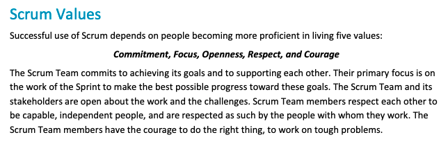

---
author:
- Dr. Gordon Wright
authors:
- Dr. Gordon Wright
bibliography:
- grefs.bib
csl: apa7.csl
date-format: DD MMMM, YYYY
editor: visual
embed-resources: true
menu: true
modulecode: PS52007D
navigation-mode: linear
title: Lab02
toc-title: Table of contents
website:
  description: Materials for PS52007D Research Methods in Psychology at
    Goldsmiths, University of London
  page-footer:
    background: "#000080"
    left: |
      Content 2022 by gordon wright. All content licensed under a
      ` `{=html} [Creative Commons
      Attribution-NonCommercial-ShareAlike 4.0 International license (CC
      BY-NC-SA 4.0)](https://creativecommons.org/licenses/by-nc-sa/4.0/)
    right: "This page is built with ☕,❤️and
      [Quarto](https://quarto.org/)."
  repo-actions:
  - edit
  - issue
  repo-url: "https://github.com/LittleMonkeyLab/PS52007Dslides/"
  resources:
  - \_site/lectures/\*.pptx
  sidebar:
    background: "#000080"
    contents:
    - contents:
      - ../preludeshub.qmd
      - ../lectureshub.qmd
      - ../labshub.qmd
      - ../extrashub.qmd
      section: Weekly Materials
    search: true
    style: docked
  site-url: "https://ps52007dslides.littlemonkeylab.com"
  title: Materials for PS52007D Research Methods in Psychology
---

## Today's activities

1.  Complete the Pulse

2.  Finalise your groups (3 or 4 people, all from same Personal Tutorial
    group)

    -   Submit a list of names to your Lab Tutor

    -   Discuss any problems you are facing

3.  Agree a broad general focus for your group research and write it in
    your lab notebook

    -   This is now functioning and available in the right hand margin
        of the VLE page. It's an experiment, so please give feedback!

4.  Start establishing how you are going to work as a team and
    identifying milestones

# Teamwork & Project Management ideas

## Apply "Scrum' process?

In short, it's a transparent, accountable, transparent and pragmatic
approach to project delivery.

# Key Project Milestones

# Teamwork & Project Management ideas

## Apply "Scrum' process?

In short, it's a transparent, accountable, transparent and pragmatic
approach to project delivery.

## Scrum-style \'stand-up\' meetings at the start of each lab?

3 questions for your short \'stand-up meeting\' every week. No more than
10 minutes.

Can be done face to face or easily online in advance or with remote
colleagues (e.g. via WhatsApp)

1.  **What have you done since the last lab session? (Progress)**

2.  **What will you be doing before the next lab session? (Plan)**

3.  **Can you identify any obstacles to achieving the plan? (Problems)**

If anything arises in point 3... Engage with your Lab Tutor during the
session and resolve it!

\*\"Scrum\" is a project management approach used extensively in the
tech and media sectors

# Key Project Milestones

## Milestones(4 key phases of activity)

## The unmissables

::: incremental
-   Submission of Critical Proposal by 10am 4th November
-   Ethics submission prior to end of Term 1
    -   Requires fully developed task and materials inc. Information
        Sheet, Informed Consent, Debriefing Materials

    -   Lab Tutors must sign off all ethics applications (1 week
        turnaround) and they could very likely return it to you for
        changes

    -   Ethical Approval will be \'fast-tracked\' but can take 1-2 weeks
-   Data collection can begin as soon as you have Ethical Approval
-   Data collection will be halted at Reading Week in Term 2
-   Mini-Dissertation deadline 10am 31st March 2023
:::

## Think about the rest of your coursework

Try to anticipate when you will have busy times in the year and plan
ahead

Do you have any personal obligations that will affect your availability?

## Think about your average week

When will you do your independent study?

When will you meet as a group?

What will you do if you miss class due to illness?

## Your first MD Personal Tutor Session is next week

You will need to present your general topic area, and any thoughts
around how you are going to do the research.

Your personal tutor will be able to help you think about the realities
of doing the work, but signalling the general area and type of research
you want to do is most useful.

::: incremental
-   How will you do this most effectively?
-   What visual aids will you use?
-   Will you identify references?
-   Will you plan or prepare? You\'ve got 50 minutes for all your
    groups...
:::

## Personal Tutor management

Your Personal Tutor will be a HUGE help this year. Make sure they get
the best information possible right at the start.

Do you think it might be a good idea to work as an entire Personal Tutor
group and put something together to help your PT manage potential
information overload?

::: incremental
-   A document with group name, topic and team members?
-   Maybe a shared folder with some illustrative papers?
-   What about a brief powerpoint with 1 slide per group that your PT
    can use moving forwards?
:::

## Over to you!
