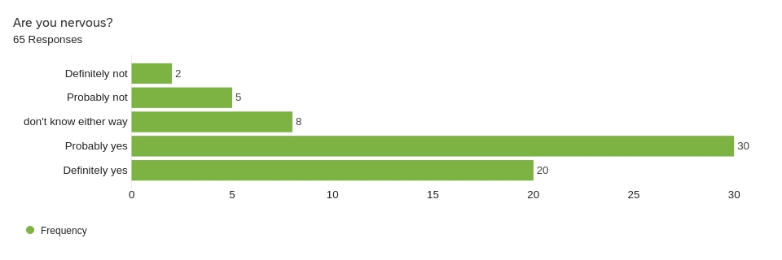
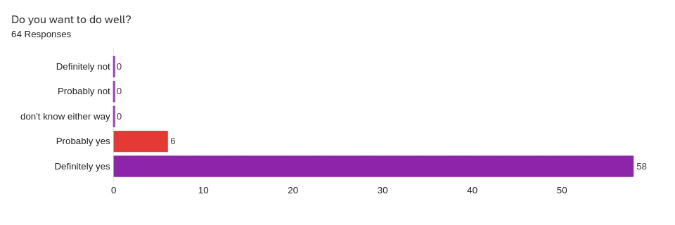
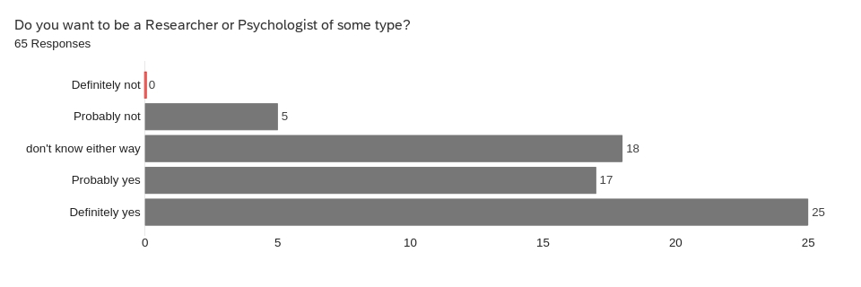
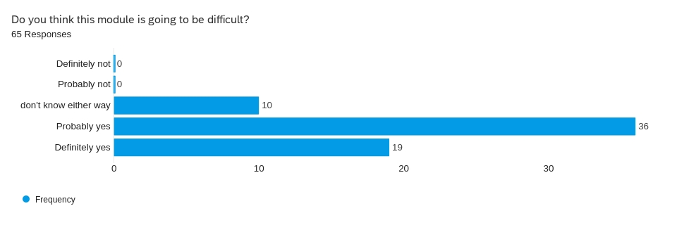
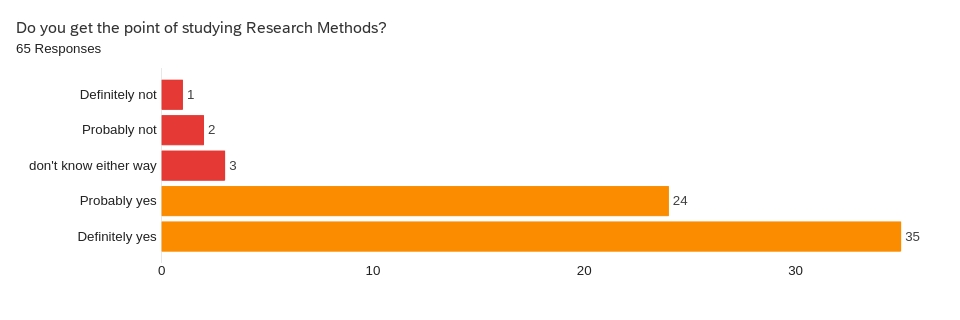
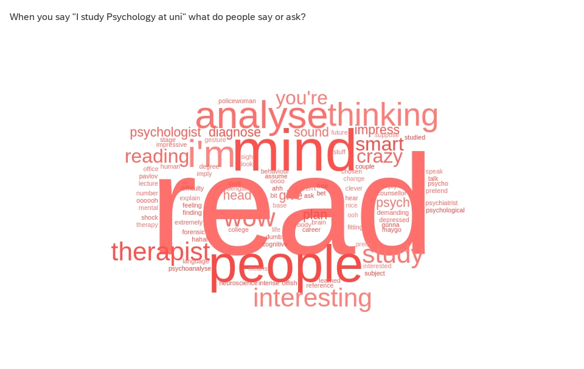
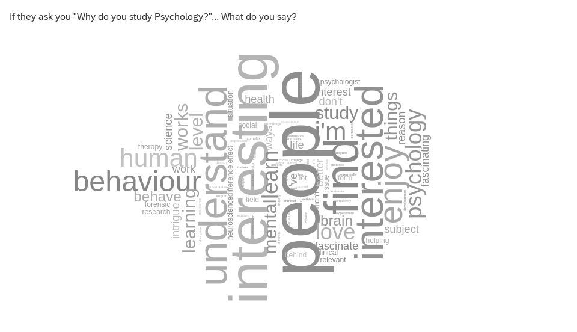
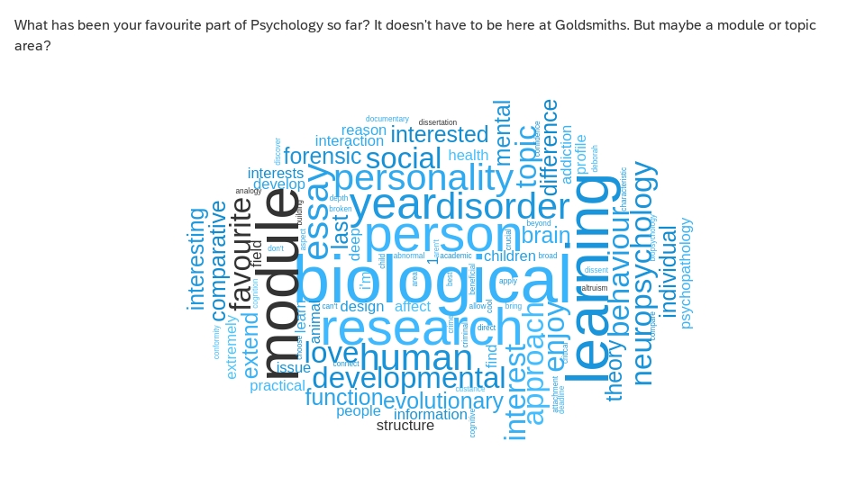
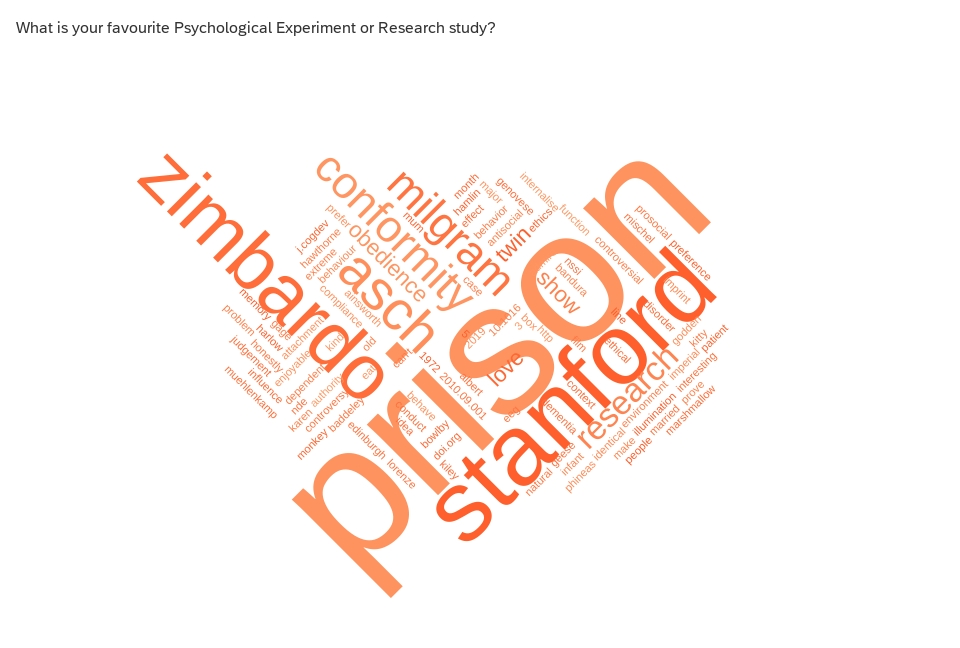

---
author:
- Dr. Gordon Wright
authors:
- Dr. Gordon Wright
bibliography:
- ../grefs.bib
csl: ../apa7.csl
date-format: DD MMMM, YYYY
editor: visual
embed-resources: true
menu: true
modulecode: PS52007D
navigation-mode: linear
title: Induction Survey Results
toc-title: Table of contents
website:
  description: Materials for PS52007D Research Methods in Psychology at
    Goldsmiths, University of London
  page-footer:
    background: "#000080"
    left: |
      Content 2022 by gordon wright. All content licensed under a
      ` `{=html} [Creative Commons
      Attribution-NonCommercial-ShareAlike 4.0 International license (CC
      BY-NC-SA 4.0)](https://creativecommons.org/licenses/by-nc-sa/4.0/)
    right: "This page is built with ☕,❤️and
      [Quarto](https://quarto.org/)."
  repo-actions:
  - edit
  - issue
  repo-url: "https://github.com/LittleMonkeyLab/PS52007Dslides/"
  resources:
  - \_site/lectures/\*.pptx
  sidebar:
    background: "#000080"
    contents:
    - contents:
      - ../../preludeshub.qmd
      - ../../lectureshub.qmd
      - ../../labshub.qmd
      - ../../extrashub.qmd
      section: Weekly Materials
    search: true
    style: docked
  site-url: "https://ps52007dslides.littlemonkeylab.com"
  title: Materials for PS52007D Research Methods in Psychology
---

{fig-align="center"}

------------------------------------------------------------------------

{fig-align="center"}

------------------------------------------------------------------------

{fig-align="center"}

------------------------------------------------------------------------

{fig-align="center"}

------------------------------------------------------------------------

{fig-align="center"}

------------------------------------------------------------------------

{fig-align="center"}

------------------------------------------------------------------------

------------------------------------------------------------------------

------------------------------------------------------------------------

------------------------------------------------------------------------

------------------------------------------------------------------------

------------------------------------------------------------------------

------------------------------------------------------------------------

