---
author:
- Dr Gordon Wright
authors:
- Dr Gordon Wright
bibliography:
- ../grefs.bib
csl: ../apa7.csl
date: 10 October, 2022
date-format: DD MMMM, YYYY
editor: visual
embed-resources: true
footer: "[VLE](https://learn.gold.ac.uk/course/view.php?id=24472)"
links-as-notes: true
logo: images/RMIPHEX.png
menu: true
modulecode: PS52007D
navigation-mode: linear
preview-links: true
subtitle: Asking good questions and gathering reliable evidence
title: Lecture02
toc-title: Table of contents
website:
  description: Materials for PS52007D Research Methods in Psychology at
    Goldsmiths, University of London
  page-footer:
    background: "#000080"
    left: |
      Content 2022 by gordon wright. All content licensed under a
      ` `{=html} [Creative Commons
      Attribution-NonCommercial-ShareAlike 4.0 International license (CC
      BY-NC-SA 4.0)](https://creativecommons.org/licenses/by-nc-sa/4.0/)
    right: "This page is built with ☕,❤️and
      [Quarto](https://quarto.org/)."
  repo-actions:
  - edit
  - issue
  repo-url: "https://github.com/LittleMonkeyLab/PS52007Dslides/"
  resources:
  - \_site/lectures/\*.pptx
  sidebar:
    background: "#000080"
    contents:
    - contents:
      - ../../preludeshub.qmd
      - ../../lectureshub.qmd
      - ../../labshub.qmd
      - ../../extrashub.qmd
      section: Weekly Materials
    search: true
    style: docked
  site-url: "https://ps52007dslides.littlemonkeylab.com"
  title: Materials for PS52007D Research Methods in Psychology
---

## Key topics today

-   The week ahead
-   Some Induction Week Poll insights \[in the lecture\]
-   The research process you are beginning
-   A couple of CHIP topics to vote on
-   Lab preview - The process, time-management and teamwork

## The week ahead

This week (week 2) you have your Social Psychology Essay Tutorial

"Sexual Economics: Theory and Patriarchy"

> ["*Is sex a female commodity that women exchange for men's resources?
> Advantages and disadvantages of applying social exchange theory to
> understanding heterosexual relationships.*"]{.takeaway}
>
> Deadline 10am Friday 21st October (end of week 3)
>
> Feedback on/by 11th November

::: notes
Mention Roy Baumeister. A very creative Psychologist
:::

# Insert Induction Week Poll insights here

# Did you break out the popcorn for the 'Prelude'?

------------------------------------------------------------------------

## 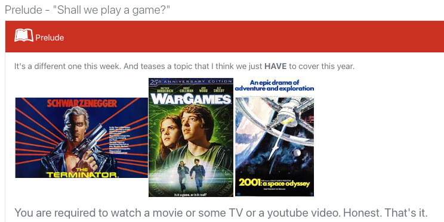

------------------------------------------------------------------------

## Did any of you enjoy my movie recommendations?

Did you pick up on the theme?

I'd actually already kinda introduced it...

# from last week

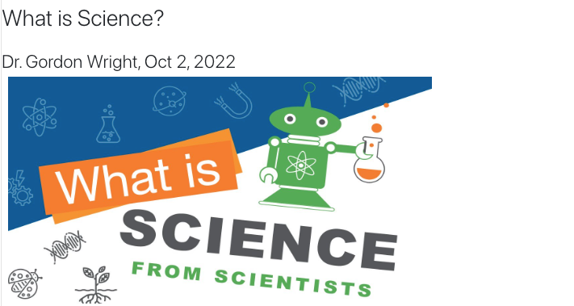

------------------------------------------------------------------------

## A confession

::: incremental
-   I didn't make that article 'I' wrote terribly obvious
-   for a reason
-   it felt a bit weird
-   I didn't write it
-   But there isn't really anything stopping me claiming so...
-   [Or is there?]{.shout}
:::

## A conundrum

I'm going to be fiercely recommending the use of AI tomorrow.

And ALSO warning you against its use elsewhere

huh?

## CHIP topics

I want to briefly draw your attention to the third (final) piece of
coursework for this module, the so-called 'CHIP Learning Log'

The earlier we flag topics and introduce little glimmers of content, the
easier that will be.

1 - What is Science? An amazing opportunity to consider this
[while]{.underline} you do your Mini-Dissertation

(A more reliable overview from Professor Ed Diener here) [**Open
Educational Resource**]{.underline}

Diener, E. (2022). Why science?. In R. Biswas-Diener & E. Diener (Eds),
*Noba textbook series: Psychology.* Champaign, IL: DEF publishers.
<http://noba.to/qu4abpzy>

2 - Artificial Intelligence - Promise or Peril?

## CHIP topic approval process

Anyone can suggest a topic, by identifying where it sprang to mind.

\# people need to approve it by confirming it is relevant, with a brief
rationale.

The more you engage, the more topics you get to choose from.

::: incremental
-   A concept or debate within Psychology
-   A historical issue or controversy
-   A methodology or approach and its promises or limitations
-   A distinctive or divisive topic
-   A modern innovation or applied challenge
:::

<https://www2.open.ac.uk/openlearn/CHIPs/>

## A psychologist? A scientist?

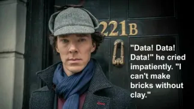

# Prize for guessing my favourite Psychologist

## Scientists base their 'claims' on EVIDENCE

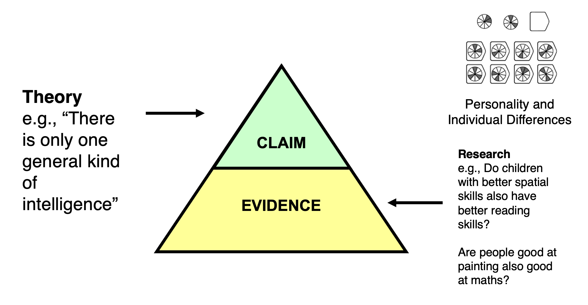

## Evidence quality = claim quality!

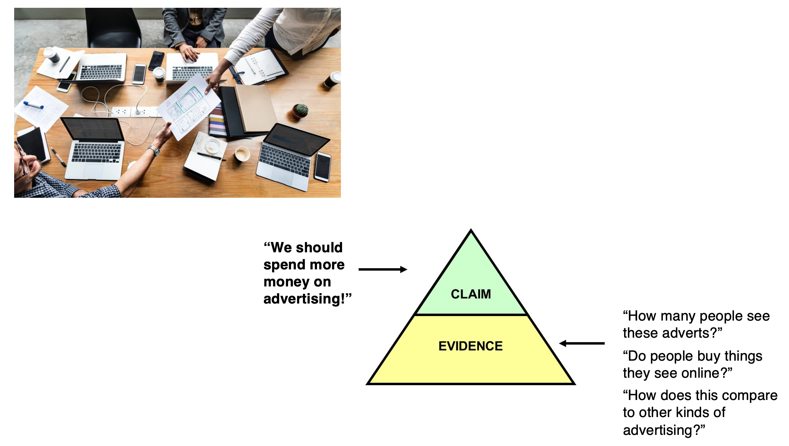

## It starts with a hypothesis

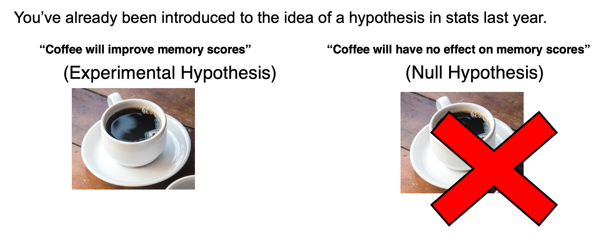

## recap on hypotheses

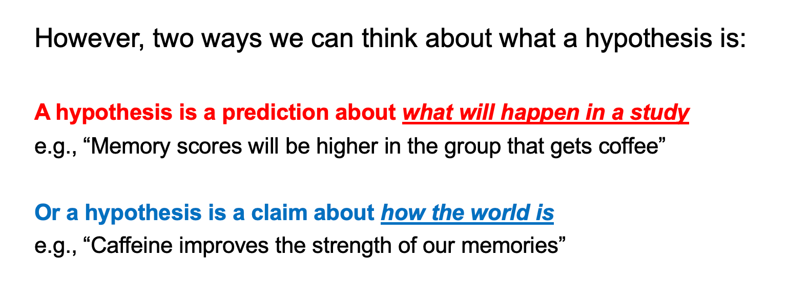

## The research process

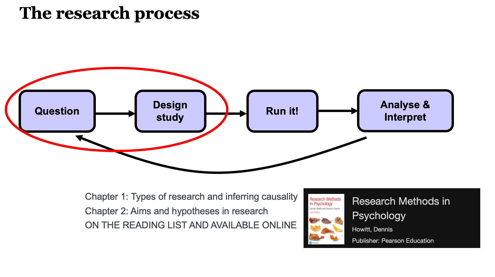

## The simplicity of an experiment

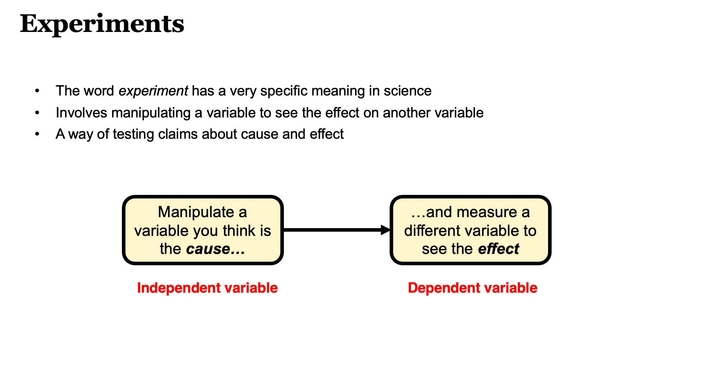

## Operationalisation

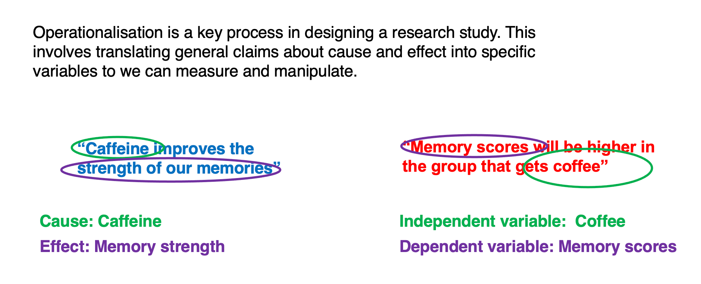

## The challenge of operationalisation

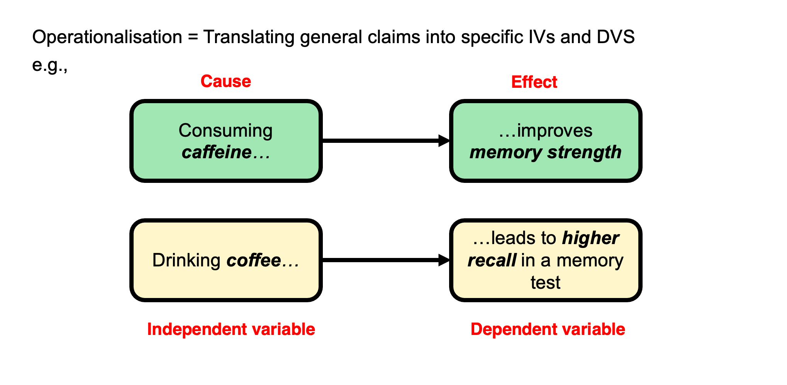

## A toy example

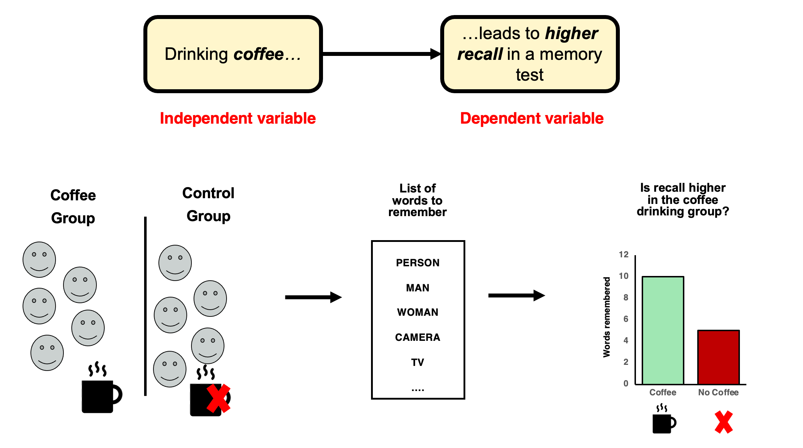

## Extraneous variables

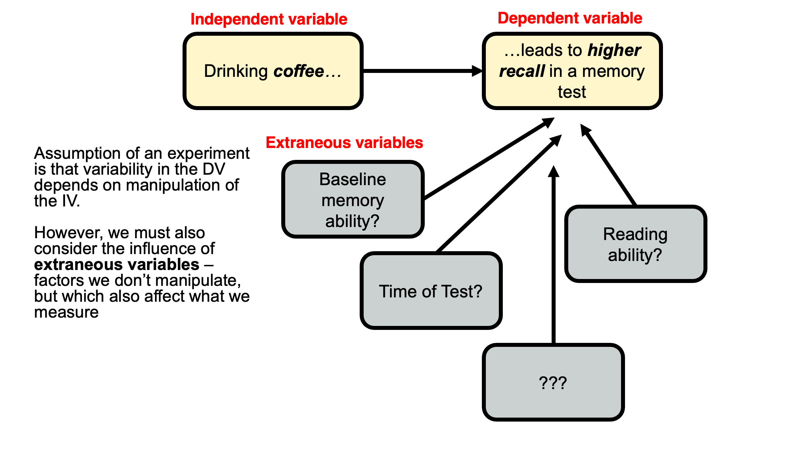

## Usually...

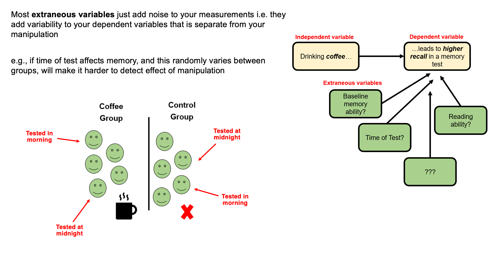

## but occasionally...

you hear of 'confounds' or ['confounding variables']{.shout}

A confounding variable is an extraneous variable that [systematically
varies]{.underline} with one of your independent variables. These are
rare, but nothing can save the experiment.

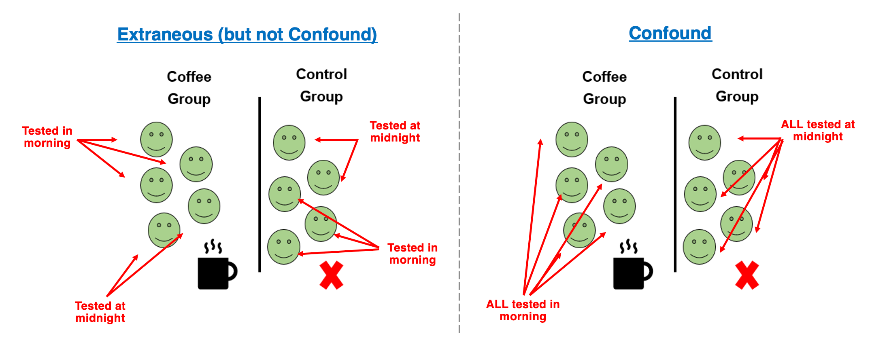

## An impossible interpretation

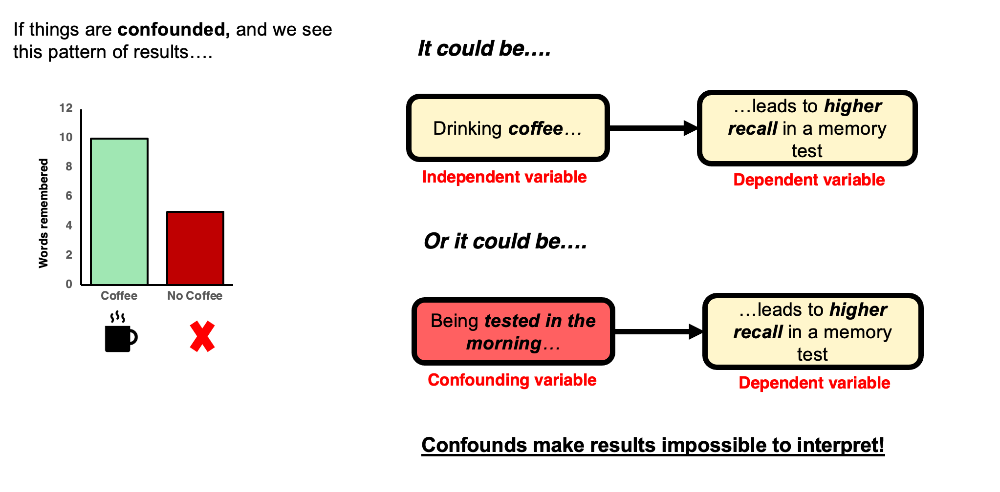

## Manipulations almost always introduce potential confounds

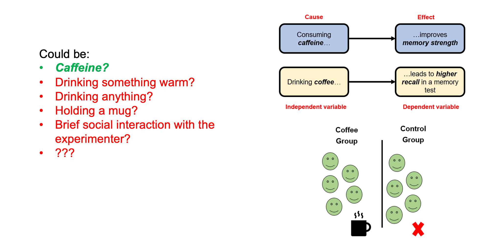

## Experimental skill + careful thought + piloting + randomness!

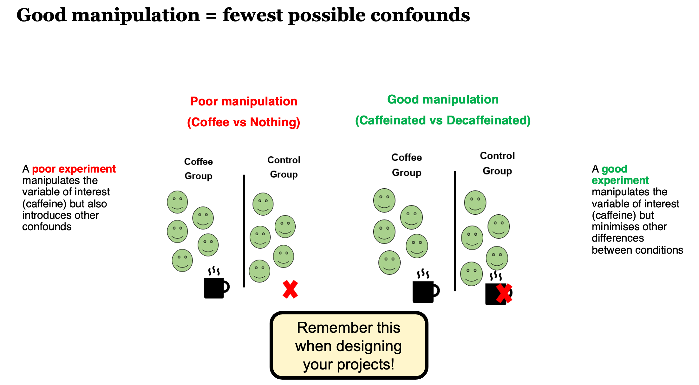

## The importance of operationalising your variables well

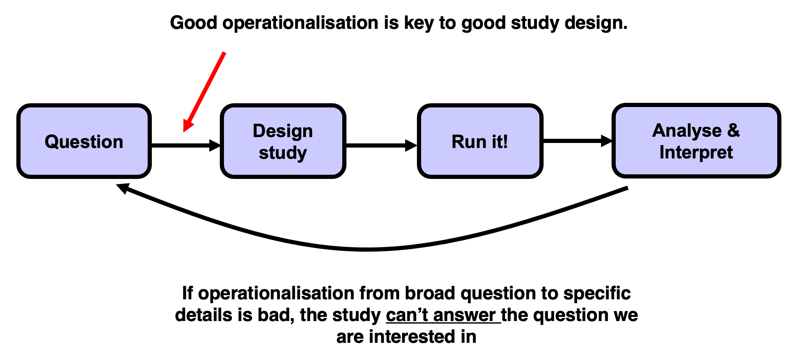

## Reading along

I highly recommend reading along with the general topics we cover in the
first few weeks.

Research Methods in Psychology by Dennis Howitt and Duncan Cramer is
excellent. Chapter 2 in that book (right at the top of the module
reading list and
[here](https://www.vlebooks.com/Product/Index/896220?page=0)) deals with
Hypotheses and aims of research, essentially what we cover this week,
and Chapter 1 deals with the basics and golden rules of research design
and designing good experiments.

# Lab preview

## On Tuesday

We will be working on:

-   How to do a literature search like a pro (based on your newly chosen
    topic!)

-   Some ideas for group working and time management over the year

-   Previewing your week 3 Personal Tutor meeting

**Activities and resources will be provided**

### Any Questions?

# 
